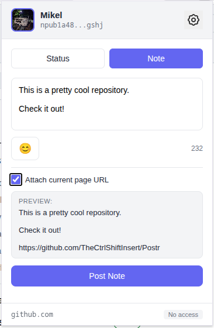
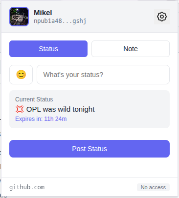
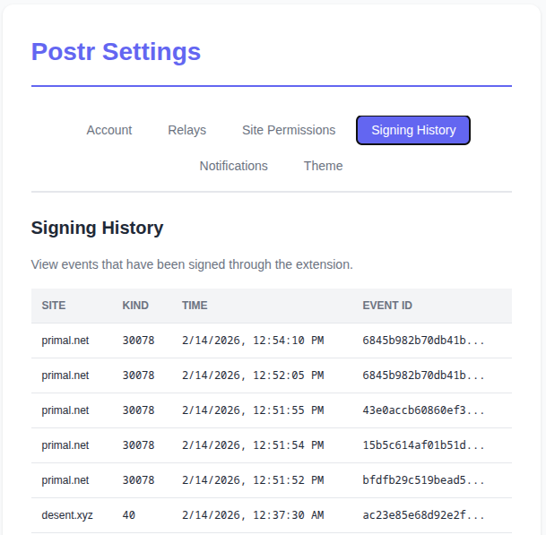
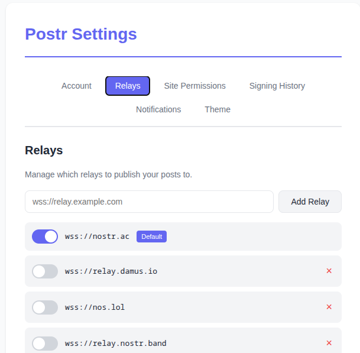
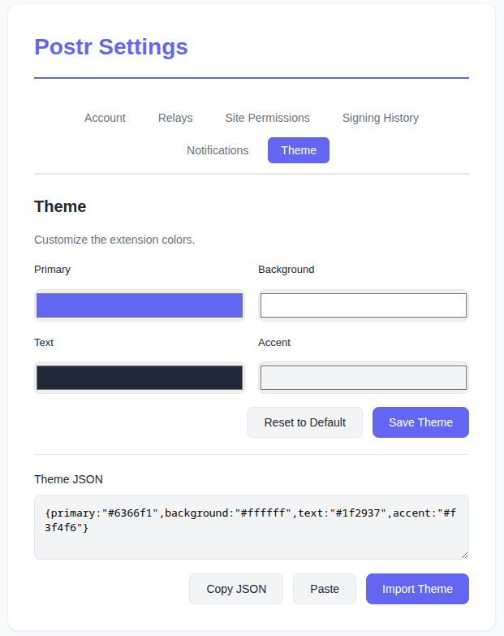

# Postr

A Chrome extension for signing events and posting status updates (NIP-38) / text notes.


## Features

- **Status Updates**: Post 24-hour expiring status updates with optional emoji
- **Text Notes**: Post quick text notes with optional URL attachment
- **Secure Storage**: NSEC stored securely in Chrome extension storage
- **Relay Management**: Add/remove/enable/disable custom relays
- **Profile Display**: Shows user profile picture, name, and npub
- **Theme Customization**: Customize primary, background, text, and accent colors
- **Fallback Relays**: Automatically queries multiple relays for metadata
- **NIP-07 Support**: Allows websites to request signatures via the standard Nostr interface

## Screen Shots

Post Note


Status Update


Signing History


Relay Config


CustomThemes


## Installation

** Package submitted to Chrome Extension Store, waiting on approval. 

1. Open Chrome and navigate to `chrome://extensions/`
2. Enable "Developer mode" in the top right
3. Click "Load unpacked"
4. Select the `postr` folder


## Usage

1. Click the Postr icon in your browser toolbar
2. Login with your NSEC in the settings page
3. Toggle between "Status" and "Note" modes
4. Post your updates!


## File Structure

```
postr/
├── manifest.json           # Extension manifest (V3)
├── background.js           # Background script
├── background-loader.js    # Service worker loader for MV3
├── popup/                  # Main popup UI
│   ├── popup.html
│   ├── popup.css
│   ├── popup.js
│   ├── sign-dialog.html
│   └── sign-dialog.js
├── options/                # Settings page
│   ├── options.html
│   ├── options.css
│   └── options.js
├── content/                # Content scripts for NIP-07
│   ├── content-bridge.js
│   └── nostr-provider.js
├── shared/                 # Shared utilities
│   ├── nostr-tools.js      # Nostr library
│   ├── storage.js          # Storage utilities
│   ├── relay-manager.js    # Relay connection manager
│   ├── nostr-client.js     # Nostr client logic
│   ├── nip07-signer.js     # NIP-07 signing logic
│   └── emoji-picker.js     # Native emoji picker
└── icons/                  # Extension icons
    ├── icon16.png
    ├── icon48.png
    └── icon128.png
```


## Default Relay

- wss://nostr.ac


## Fallback Relays for Metadata

- wss://relay.damus.io
- wss://nos.lol
- wss://relay.nostr.band
- wss://relay.snort.social


## Security

- NSEC is stored in Chrome's encrypted local storage
- Private key is hidden by default and only shown when explicitly requested
- No external servers - all relay communication is direct WebSocket


## Nostr Support

- NIP-07: window.nostr capability for website integration
- NIP-38: User Statuses
- Kind 1: Text Notes
- Kind 0: Metadata
- Kind 30315: Status Events


## License

MIT
